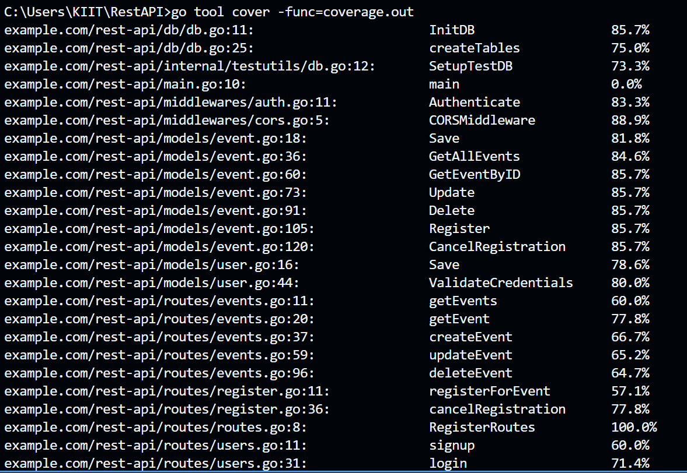

# Event REST API

A simple API built with Go and Gin providing user authentication and CRUD operations for events. Data is stored in SQLite.

## Quick Start

1. Fetch dependencies:

   ```bash
   go mod tidy
   ```
2. Run the server:

   ```bash
   go run main.go
   ```

The server will listen on `http://localhost:8080`.

## API Overview

| Method | Endpoint               | Description                  |
| ------ | ---------------------- | ---------------------------- |
| POST   | `/signup`              | Register a new user          |
| POST   | `/login`               | Authenticate and receive JWT |
| GET    | `/events`              | List all events              |
| GET    | `/events/:id`          | Get event by ID              |
| POST   | `/events`              | Create a new event *(auth)*  |
| PUT    | `/events/:id`          | Update an event *(auth)*     |
| DELETE | `/events/:id`          | Delete an event *(auth)*     |
| POST   | `/events/:id/register` | Register for event *(auth)*  |
| DELETE | `/events/:id/register` | Cancel registration *(auth)* |

> Every endpoint returns JSON. For protected routes, send the token returned from `/login` in the `Authorization` header using the `Bearer <token>` format.

## Testing with REST Client (Preferred)

### Replace `replace with the token you will get from Login either through REST Client, Frontend or CURL` with the JWT token in every request where it is required.

Inside `api-test/` you will find `.http` files for each endpoint. Install the **REST Client** extension in VS Code, open a `.http` file and click **Send Request** to try the API without crafting curl commands manually.

## Sample `curl` Usage

### `curl.exe` Raw Commands (Single‑line) *(DO NOT USE POWERSHELL; THERE IS SOME ISSUE WITH IT)*

These commands work in **cmd.exe** without line continuations:

**1. Signup**

```bash
curl.exe -X POST http://localhost:8080/signup -H "Content-Type: application/json" --data "{\"email\":\"user3@example.com\",\"password\":\"secret\"}"
```

**2. Login** *(to view full JSON response)*

```bash
curl.exe -v -X POST http://localhost:8080/login -H "Content-Type: application/json" --data "{\"email\":\"user3@example.com\",\"password\":\"secret\"}"
```

> Copy the value of the `token` field from the response.

**3. Create Event**

```bash
curl.exe -X POST http://localhost:8080/events -H "Authorization: Bearer <YOUR_TOKEN_HERE>" -H "Content-Type: application/json" --data "{\"name\":\"Party\",\"description\":\"Fun\",\"location\":\"Town\",\"dateTime\":\"2025-01-01T15:30:00Z\"}"
```

## Simple Frontend

A minimal frontend is located in `frontend/`. Serve it with:

```bash
cd frontend
python3 -m http.server 8081
```

Open `http://localhost:8081` in your browser to interact with the API via forms.

## Running Tests

Execute unit and integration tests with Go's testing tool:

```bash
go test ./... -coverprofile=coverage.out
```

After running, view overall coverage with:

```bash
go tool cover -func=coverage.out
```

The included tests achieve over **75%** coverage.

---

## 🧩 Tech Stack (What’s under the hood?)

| Layer                  | Library / Tool                                                | Reason                                     |
| ---------------------- | ------------------------------------------------------------- | ------------------------------------------ |
| Language               | **Go 1.22**                                                   | Fast, concurrency‑friendly                 |
| Web framework          | **Gin‑Gonic**                                                 | Lightweight router, middleware support     |
| Database               | **SQLite 3** (`github.com/mattn/go-sqlite3`)                  | Zero‑config, file‑based                    |
| AuthN/AuthZ            | **JWT** (`github.com/golang-jwt/jwt/v5`) + **bcrypt**         | Stateless tokens & secure password hashing |
| Testing                | Built‑in `testing`, `net/http/httptest`, **stretchr/testify** | Unit mocks + full HTTP round‑trips         |
| Manual API smoke tests | **VS Code REST Client** (`.http` files)                       | One‑click endpoint calls                   |

---

## 🌐 “API Used”

This repository **exposes** its own REST API and does **not** consume any third‑party service. All data persistence happens locally in the SQLite database.

---

## 🔬 Testing Frameworks / Tools

| Purpose                         | Tool                                         |
| ------------------------------- | -------------------------------------------- |
| Unit tests                      | Go `testing` + `stretchr/testify` assertions |
| Integration tests (router + DB) | `httptest` server instances                  |
| Coverage                        | `go test -coverprofile` & `go tool cover`    |
| Manual endpoint checks          | VS Code **REST Client**                      |

---

## 📊 Coverage Screenshot



*The image above is the actual output of `go tool cover -func=coverage.out`, showing **75 %+** total statement coverage (see `docs/coverage.png`).*

---

> **Pro‑tip:** regenerate the report anytime with
> `go test ./... -coverprofile=coverage.out && go tool cover -func=coverage.out`
